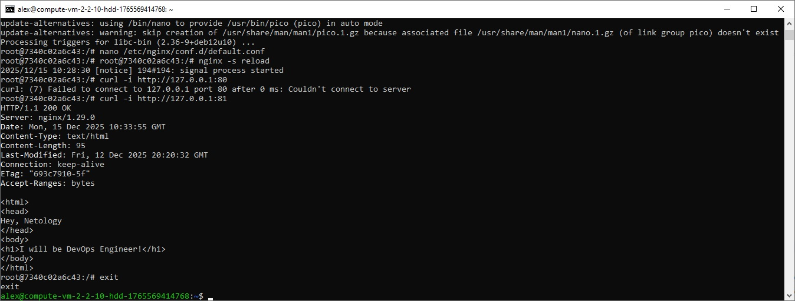
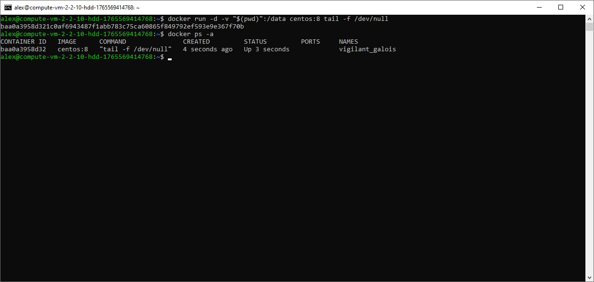
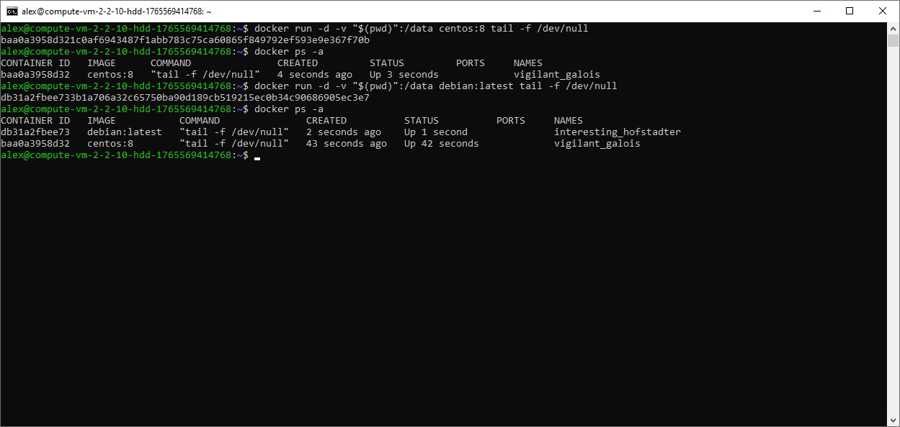
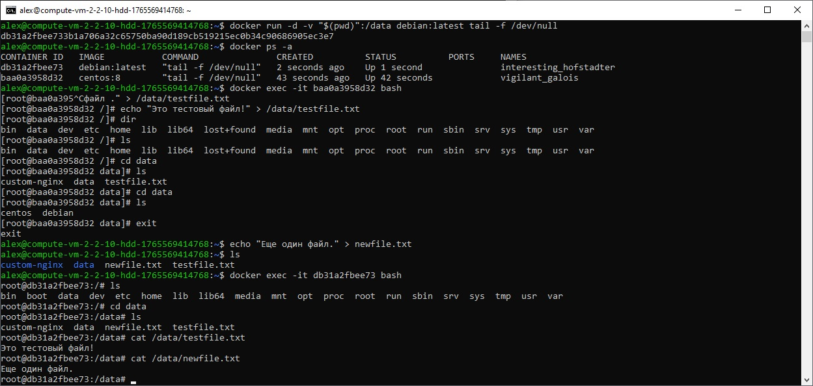

# Домашнее задание к занятию 4 «Оркестрация группой Docker контейнеров на примере Docker Compose»  

**Задача 1**

Ответ:  

https://hub.docker.com/r/alexkam75/custom-nginx

**Задача 2**

2.1

2.2

2.3

2.4

**Задача 3**

3.1-3.2

3.3

Контейнер остановился, потому что docker attach подключает к главному процессу контейнера. Нажатие Ctrl‑C обычно отправляет сигнал прерывания (SIGINT) в этот процесс. Если главный процесс завершился то Docker остановил контейнер, так как контейнер живёт ровно пока живёт его PID 1.

3.4-3.5

3.6-3.7

3.8

3.9

3.10

Проброс порта Docker устроен так: хостовый порт 8080 проброшен на порт контейнера 80 (типично 127.0.0.1:8080 -> 80/tcp).
Поменял nginx внутри контейнера с listen 80 на listen 81, то есть nginx больше не принимает соединения на 80, поэтому запросы на http://127.0.0.1:8080 (которые попадают в контейнер на 80) ломаются.
Порт-мэппинг остался прежним (8080→80), а сервис переехал на 81.

3.11

3.12

**Задача 4**

4.1

4.2

4.3-4.4

4.5

