# Домашнее задание к занятию 4 «Оркестрация группой Docker контейнеров на примере Docker Compose»  

**Задача 1**

Ответ:  

https://hub.docker.com/r/alexkam75/custom-nginx

**Задача 2**

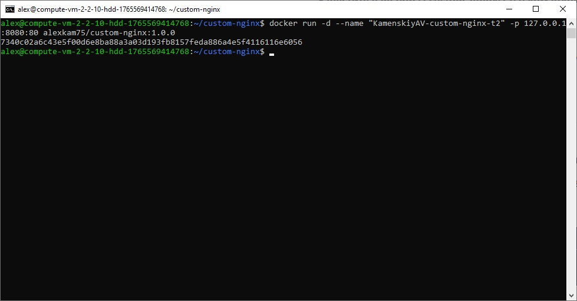
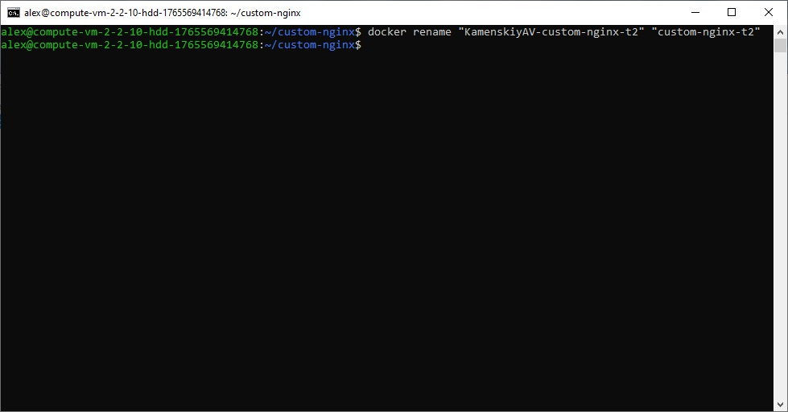
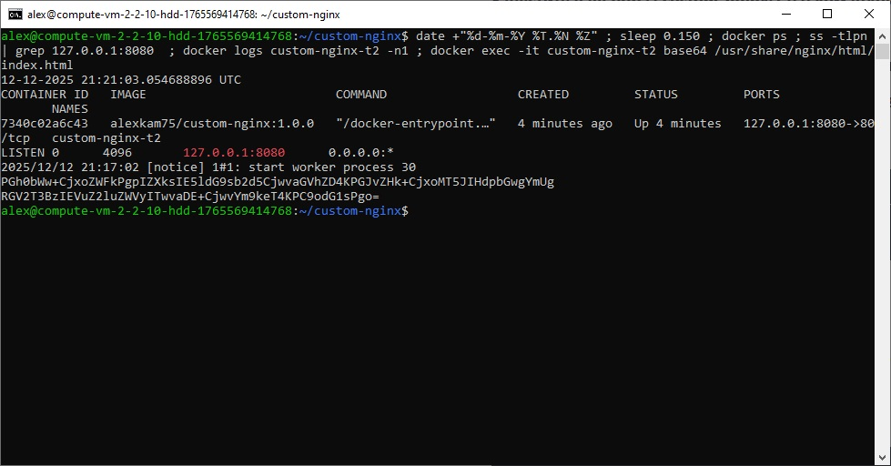
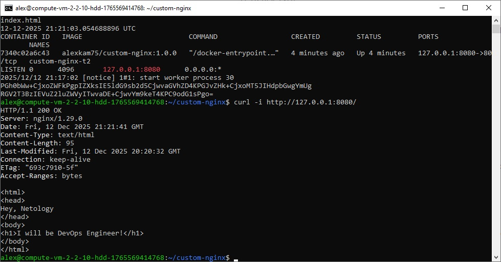

**Задача 3**

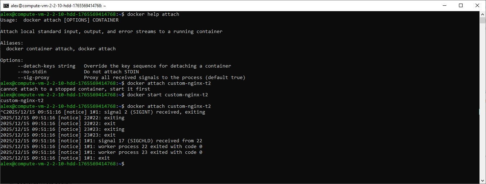
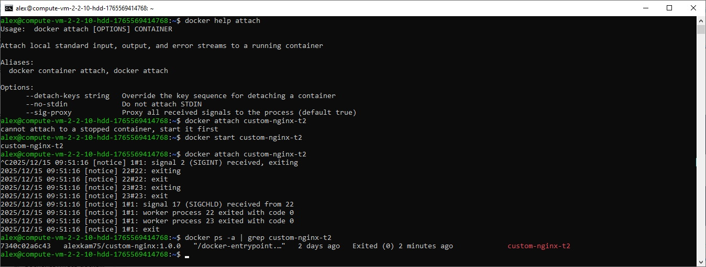

Контейнер остановился, потому что docker attach подключает к главному процессу контейнера. Нажатие Ctrl‑C обычно отправляет сигнал прерывания (SIGINT) в этот процесс. Если главный процесс завершился то Docker остановил контейнер, так как контейнер живёт ровно пока живёт его PID 1.

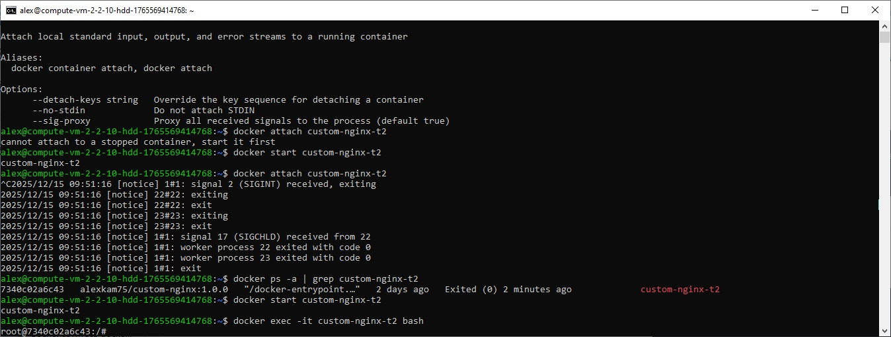
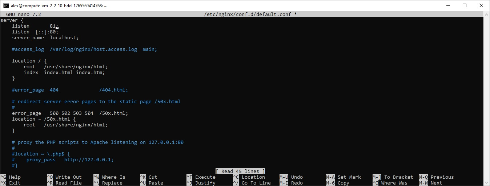
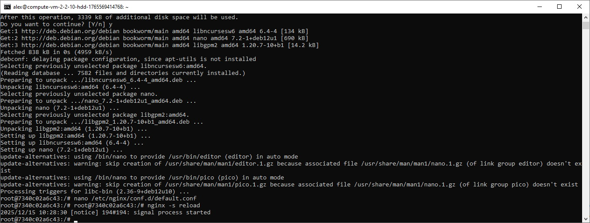
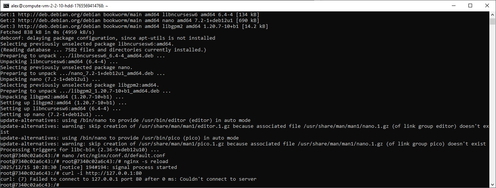
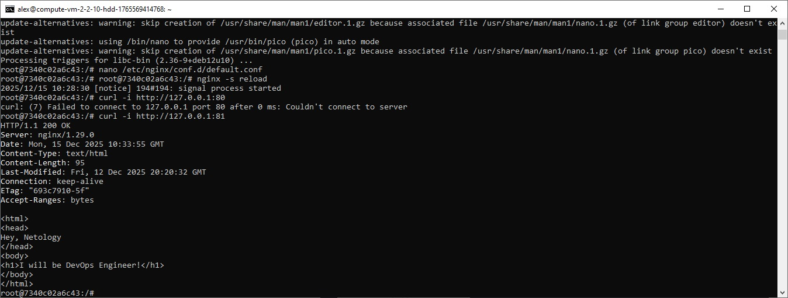

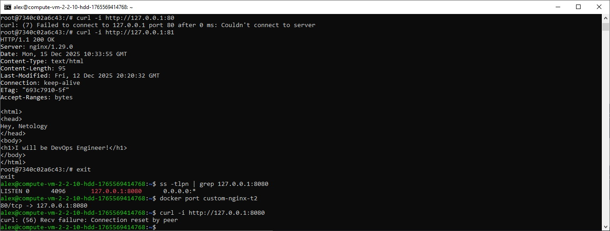
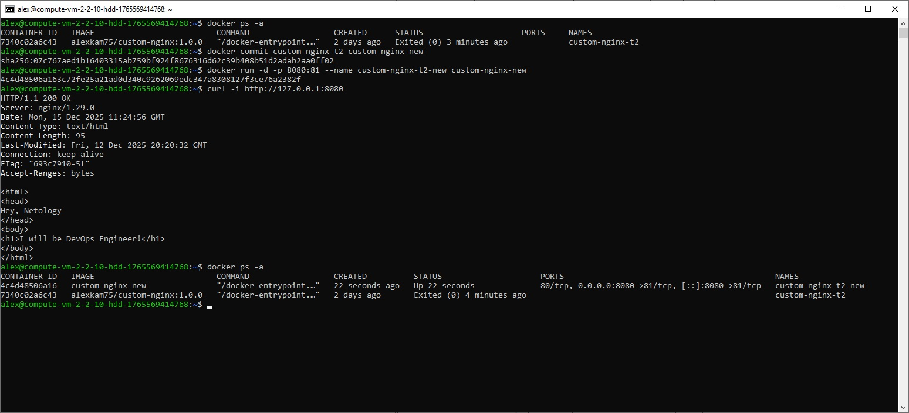
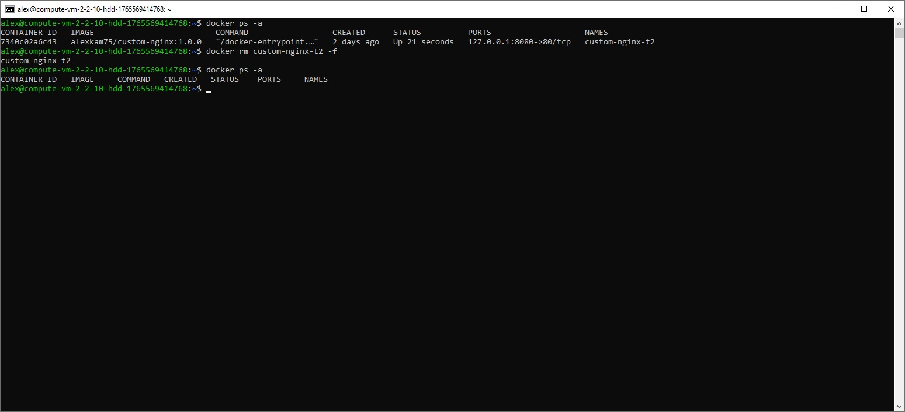

